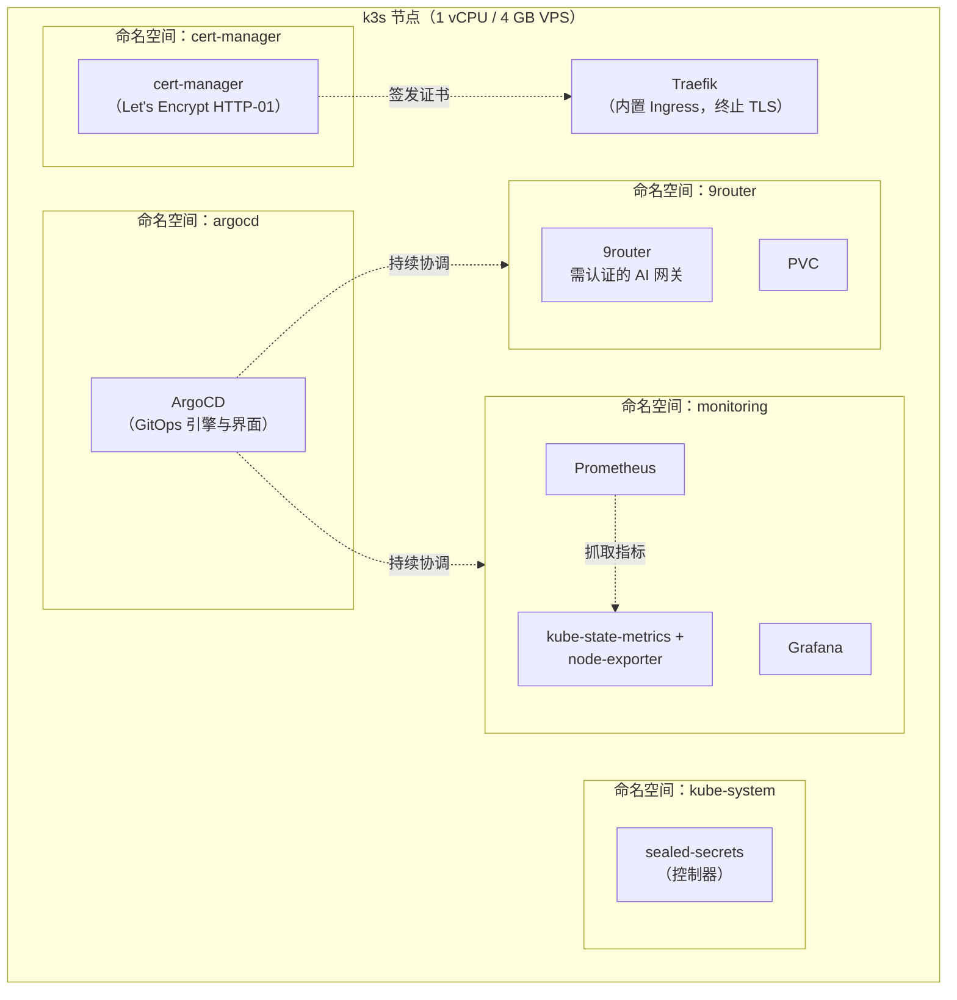
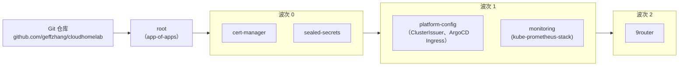
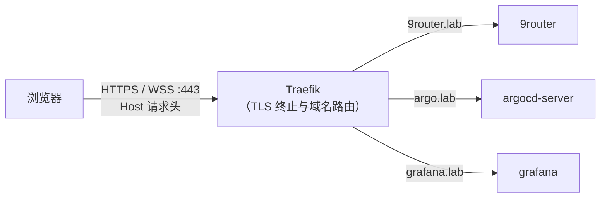
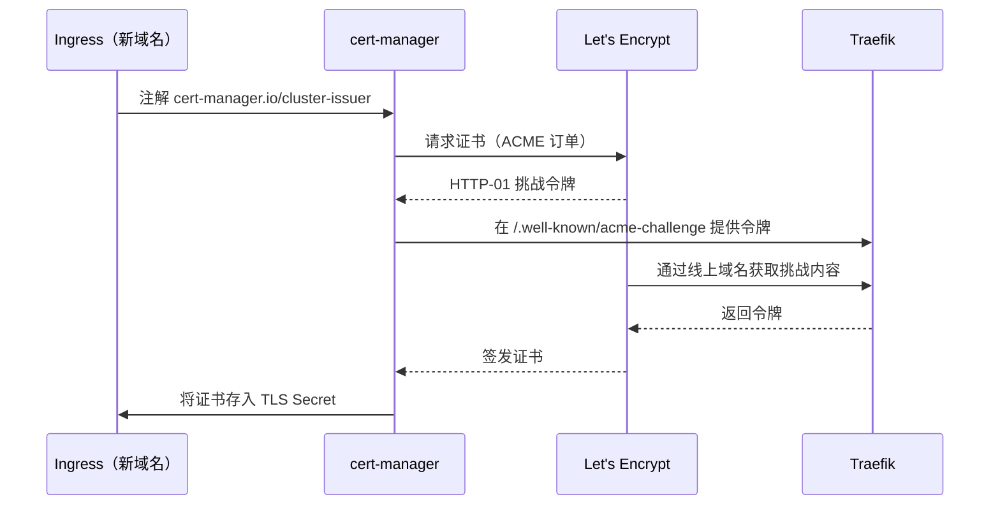

# 平台架构概览

本家庭实验室运行在一台腾讯云轻量服务器 上（2 vCPU、4 GB 内存、114.132.200.41），使用单节点 k3s；集群配置全部声明在此 Git 仓库中。ArgoCD 持续监视仓库，并使集群状态与仓库配置保持一致。其上自托管一个面向用户的应用：9Router。ArgoCD、Traefik、cert-manager、sealed-secrets、Prometheus、Grafana 和各类 exporter 提供平台基础设施支持。

有关本架构设计决策，请参阅 [ADR](../adr/)；原始设计说明见 [docs/specs](../specs/)；分步运维流程见[运维手册](../RUNBOOK.md)。

## 集群组件

控制平面和 kubelet 在同一个 k3s 进程中运行。Traefik、CoreDNS 和 local-path 存储随 k3s 一并提供。各命名空间带有便于阅读的 `homelab.csharpkit.com/description` 注解，并受到防误删保护（参见[命名空间](#namespaces)）。9Router 是一个需认证的 AI 网关，使用 PVC 持久化 OAuth 令牌和 API 密钥。

## GitOps 流程与同步波次

`bootstrap/install.sh` 安装 k3s 和 ArgoCD，然后只应用一个对象：`root` app-of-apps（应用集合的根应用）。`root` 监视 `argocd/`，并持续协调其中的每个 Application，自动执行资源清理和自愈。资源部署顺序通过同步波次指定。

- **波次 0**：cert-manager（CRD）和 sealed-secrets（解密密钥）。其余组件都依赖它们。
- **波次 1**：platform-config（`letsencrypt-prod` ClusterIssuer 和 ArgoCD 界面的 Ingress）以及 monitoring。二者都依赖波次 0 中创建的 CRD。
- **波次 2**：平台就绪后部署各应用。

添加项目时，在 `apps/` 中创建一个目录，并在 `argocd/` 中添加一个 Application，然后推送变更即可。参阅[添加应用操作指南](../operations/adding-an-app.md)。

## 流量路径

集群域名通过 `*.lab.csharpkit.com` 通配符 DNS 记录解析到节点。Traefik 负责终止 TLS，并根据 `Host` 请求头将流量路由到相应的后端 Service。WebSocket（`wss`）也经过相同路径。

完整域名列表请参阅[网络文档](../networking.md)。

## TLS 证书签发

集群中的 `letsencrypt-prod` ClusterIssuer 通过 Traefik 完成 HTTP-01 验证，因此无需 DNS 服务商令牌。证书按域名分别签发；域名解析生效后，首次请求证书时即可签发。参阅 [ADR-004](../adr/004-cert-manager-http01-vs-dns01.md)。

## 命名空间

| 命名空间 | 运行内容 |
|-----------|-----------------|
| `argocd` | GitOps 控制平面和界面（`argo.lab.csharpkit.com`） |
| `cert-manager` | TLS 自动化（Let's Encrypt HTTP-01） |
| `kube-system` | k3s 系统组件和 sealed-secrets 控制器 |
| `monitoring` | Prometheus、Grafana、exporter（`grafana.lab.csharpkit.com`） |
| `9router` | 需认证的自托管 AI 网关（Deployment + PVC）；在 PVC 上保存订阅 OAuth 令牌和签发的 API 密钥 |

每个应用和平台命名空间都带有 `homelab.csharpkit.com/description` 注解以及 `argocd.argoproj.io/sync-options: Prune=false`，因此从声明文件中移除命名空间定义不会删除正在运行的命名空间及其数据（`platform/config/namespaces.yaml`）。

## 监控模型

kube-prometheus-stack（chart 62.7.0）已针对节点资源进行精简：数据保留 5 天、上限 2 GB；禁用 Alertmanager（状态由 Grafana 展示），并关闭 chart 默认仪表板，改用一个经过整理的专用仪表板。9Router 的资源及健康面板使用 kube-state-metrics 和 kubelet 提供的 Kubernetes 指标，而非应用专用端点。

唯一的专用仪表板 **Homelab Overview** 包含三个分区：

| 分区 | 面板 |
|---------|--------|
| VPS | CPU 忙碌度、内存使用量、根磁盘使用量、负载、运行时间、运行中的 Pod、按类型划分的 CPU 使用量、内存构成、网络流量 |
| Kubernetes | 各命名空间的 CPU 和内存使用量、Pod 重启次数（24 小时）、内存占用最高的 Pod |
| 9Router | CPU、内存、运行中的 Pod、重启次数（24 小时）、CPU 和内存使用量变化 |

有关 ServiceMonitor 配置模式以及监控和升级说明，请参阅[添加应用操作指南](../operations/adding-an-app.md)。
