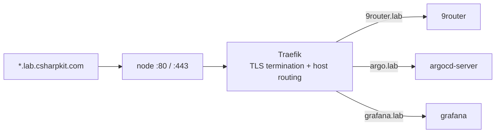

# Networking

One node, one IP, many cluster hostnames. This document describes how names reach the node, how the node routes them, and how certificates are issued. One user-facing application is self-hosted through this cluster: 9Router. Supporting hosts expose infrastructure services such as ArgoCD and Grafana. For the decisions behind this design, see [ADR-005](adr/005-wildcard-dns-traefik-sni-routing.md) and [ADR-004](adr/004-cert-manager-http01-vs-dns01.md).

## Wildcard DNS

A single wildcard A record, `*.lab.csharpkit.com`, points at the node IP. Any subdomain under `lab.csharpkit.com` resolves to the node with no further DNS change, so adding a service never touches DNS.

### Creating the DNS records

The platform needs exactly one record to serve any number of `.lab` hosts, plus an apex record (and usually `www`) for each custom domain an app uses.

| Record | Type | Value | Where to create it |
|--------|------|-------|--------------------|
| `*.lab` | A | node public IP | the `csharpkit.com` DNS provider |
| a custom apex, e.g. `yourdomain.com` | A | node public IP | that domain's DNS provider |
| `www` on the custom domain | A (or CNAME to the apex) | node public IP | same provider |

The apex of `csharpkit.com` and its `www` stay outside this cluster; only the `*.lab` label is delegated to the node, so the wildcard never collides with those public sites. Adding a `.lab` service needs no new record because the wildcard already covers it. A custom domain needs its own apex record because a wildcard for one registrable domain does not cover a different one. Keep the TTL low (300s) while setting up, and confirm resolution with `dig +short <host>` before expecting a certificate: cert-manager can only pass HTTP-01 once the host resolves to the node.

## Traefik ingress and SNI host routing

Traefik ships with k3s and is the single ingress controller. Every service declares an `Ingress` with `ingressClassName: traefik` and a `host:` rule. Ports 80 and 443 are shared by all hosts; Traefik terminates TLS, reads the SNI / `Host` header, and routes to the matching backend Service. HTTP, HTTPS, and WebSocket (`wss`) all route this way.



## 9Router streaming route

`9router.lab.csharpkit.com` is a direct public DNS A record to the VPS. No Cloudflare proxy, Cloudflare Tunnel, Nginx, or Tailscale hop is present. Traefik terminates TLS and sends requests to `router.9router.svc:80`, which targets the 9Router pod on port 20128. A service-scoped `ServersTransport` preserves long inference streams without changing timeout policy for unrelated applications.

## Hostname map

| Host | Backend | Notes |
|------|---------|-------|
| `argo.lab.csharpkit.com` | ArgoCD server | TLS at Traefik; ArgoCD runs insecure internally |
| `grafana.lab.csharpkit.com` | Grafana | Ingress defined in the monitoring chart values |
| `9router.lab.csharpkit.com` | Authenticated 9Router AI gateway | `9router-tls`; API key required; OAuth tokens and issued API keys stored on its PVC |

## Adding a custom domain to an app

To serve an app on its own domain:

1. **DNS.** Create an apex `A` record for the domain pointing at the node IP, and usually a `www` record too (see the records table above). Confirm both resolve with `dig +short yourdomain.com` and `dig +short www.yourdomain.com`.
2. **Ingress.** Add the hostnames to the app. If the app also serves a host that might not resolve yet, put the custom domain in its own `Ingress` so a pending certificate on the other host cannot drop its TLS (the two-Ingress pattern above). Otherwise add the host rules and a matching `tls:` entry to the existing Ingress:

   ```yaml
   spec:
     rules:
       - host: yourdomain.com
         http: &routes
           paths:
             - path: /
               pathType: Prefix
               backend:
                 service:
                   name: client
                   port: { number: 80 }
       - host: www.yourdomain.com
         http: *routes
     tls:
       - hosts: [yourdomain.com, www.yourdomain.com]
         secretName: <app>-own-tls
   ```

3. **App config.** Update any origin or CORS setting to the new domain.
4. **Push.** ArgoCD applies it and cert-manager issues the certificate over HTTP-01 as soon as the domain resolves. Watch it: `kubectl -n <app> get certificate`. The host is live once the certificate is `Ready`.

No node access is needed. It is all git plus the DNS records.

## cert-manager

A single `ClusterIssuer`, `letsencrypt-prod`, solves ACME HTTP-01 through Traefik (`platform/config/cluster-issuer.yaml`). Each Ingress requests a certificate with the `cert-manager.io/cluster-issuer: letsencrypt-prod` annotation and a `tls:` block naming the Secret to store it in. Certificates are per host and issue on first request once the host resolves; the wildcard record covers resolution, not certificates. No DNS provider token is used. See [ADR-004](adr/004-cert-manager-http01-vs-dns01.md).

## Node firewall

A new or migrated node only needs to allow ports 80 and 443 in any provider-level firewall. See the [security doc](security/security.md) for the recommended posture.
